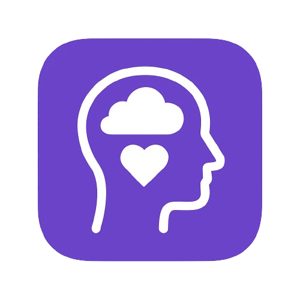

# Mind Ease - Mental Wellness Companion



A comprehensive mental wellness app designed to help users track their mood, practice mindfulness, and engage in relaxing activities to support their mental health journey.

## 🌟 Features

### 📊 Mood Tracking
- **Visual Mood Selection**: Choose from 7 different emotions with custom icons
- **Detailed Mood Logging**: Add notes, triggers, energy levels, and sleep quality
- **Weekly Reports**: Get personalized insights and patterns from your mood data
- **Trend Analysis**: Track your emotional well-being over time

### 🧘 Mindfulness & Exercises
- **Guided Breathing**: 4-7-8, Diaphragmatic, and other breathing techniques
- **Meditation Sessions**: Grounding exercises and mindfulness practices
- **Text-to-Speech**: Audio-guided instructions for all exercises
- **Animated Visuals**: Pulsing circles and calming animations

### 🎮 Relaxing Games
- **Bubble Pop Calm**: Tap floating bubbles for stress relief
- **Breathing Sync**: Follow breathing rhythms with interactive circles
- **Soothing Puzzle**: Arrange pieces to create calming patterns
- **Color Harmony**: Match colors to create peaceful palettes
- **Tic-Tac-Toe**: Classic game with AI opponent or local multiplayer

### 🏆 Gamification
- **Experience Points**: Earn XP for completing activities
- **Achievements**: Unlock badges for milestones and streaks
- **Progress Tracking**: Monitor your wellness journey
- **Streak Counters**: Build consistent habits

### 📚 Educational Content
- **Mental Health Modules**: Learn about anxiety, depression, CBT, and resilience
- **Coping Strategies**: Evidence-based techniques for mental wellness
- **Support Resources**: Information about getting help when needed

## 🚀 Getting Started

### Prerequisites
- Node.js 18+ 
- pnpm (recommended) or npm
- Expo CLI
- iOS Simulator (for iOS development)
- Android Studio (for Android development)

### Installation

1. **Clone the repository**
   ```bash
   git clone https://github.com/yourusername/mind-ease.git
   cd mind-ease
   ```

2. **Install dependencies**
   ```bash
   pnpm install
   ```

3. **Start the development server**
   ```bash
   pnpm start
   ```

4. **Run on device/simulator**
   ```bash
   # iOS
   pnpm ios
   
   # Android
   pnpm android
   
   # Web
   pnpm web
   ```

## 🏗️ Building for Production

### Using EAS Build

1. **Install EAS CLI**
   ```bash
   npm install -g @expo/eas-cli
   ```

2. **Login to Expo**
   ```bash
   eas login
   ```

3. **Configure project**
   ```bash
   eas build:configure
   ```

4. **Build for production**
   ```bash
   # Android
   eas build --platform android --profile production
   
   # iOS
   eas build --platform ios --profile production
   ```

### Manual Builds

```bash
# Android APK
expo build:android

# iOS
expo build:ios
```

## 📱 App Store Deployment

### Android (Google Play Store)

1. **Build AAB file**
   ```bash
   eas build --platform android --profile production
   ```

2. **Submit to Play Store**
   ```bash
   eas submit --platform android
   ```

### iOS (App Store)

1. **Build iOS app**
   ```bash
   eas build --platform ios --profile production
   ```

2. **Submit to App Store**
   ```bash
   eas submit --platform ios
   ```

## 🛠️ Configuration

### Environment Variables

Create a `.env` file in the root directory:

```env
EXPO_PUBLIC_SUPABASE_URL=your_supabase_url
EXPO_PUBLIC_SUPABASE_ANON_KEY=your_supabase_anon_key
```

### App Configuration

Update `app.json` with your specific details:
- Bundle identifier
- App name and description
- Icon and splash screen
- Permissions

## 📊 Database Schema

The app uses Supabase for cloud data synchronization. Key tables include:

- `user_profiles`: User information and preferences
- `mood_entries`: Mood tracking data
- `exercise_completions`: Activity completion records
- `user_achievements`: Gamification achievements
- `user_progress_backup`: Progress synchronization

## 🎨 Design System

### Colors
- **Primary**: #4ECDC4 (Teal)
- **Secondary**: #FF6B9D (Pink)
- **Background**: #1a1a2e (Dark Blue)
- **Text**: #FFFFFF (White)

### Typography
- **Headers**: Bold, large sizes
- **Body**: Medium weight, readable sizes
- **Captions**: Light weight, smaller sizes

## 🔧 Development

### Project Structure
```
mind_ease/
├── app/                    # App screens and navigation
│   ├── (tabs)/            # Tab navigation screens
│   └── nonTabs/           # Modal and detail screens
├── components/            # Reusable UI components
├── contexts/              # React contexts
├── utils/                 # Utility functions
├── theme/                 # Design system
└── assets/                # Images and static files
```

### Key Technologies
- **React Native**: Cross-platform mobile development
- **Expo**: Development platform and tools
- **TypeScript**: Type-safe JavaScript
- **Supabase**: Backend-as-a-Service
- **AsyncStorage**: Local data persistence
- **Expo Router**: File-based routing

## 📄 License

This project is licensed under the MIT License - see the [LICENSE](LICENSE) file for details.

## 🤝 Contributing

1. Fork the repository
2. Create a feature branch (`git checkout -b feature/amazing-feature`)
3. Commit your changes (`git commit -m 'Add some amazing feature'`)
4. Push to the branch (`git push origin feature/amazing-feature`)
5. Open a Pull Request

## 📞 Support

For support, email support@mindease.app or join our Discord community.

## 🙏 Acknowledgments

- Mental health professionals who provided guidance
- Open source community for amazing tools
- Beta testers for valuable feedback

---

**Mind Ease** - Supporting your mental wellness journey, one day at a time. 💚